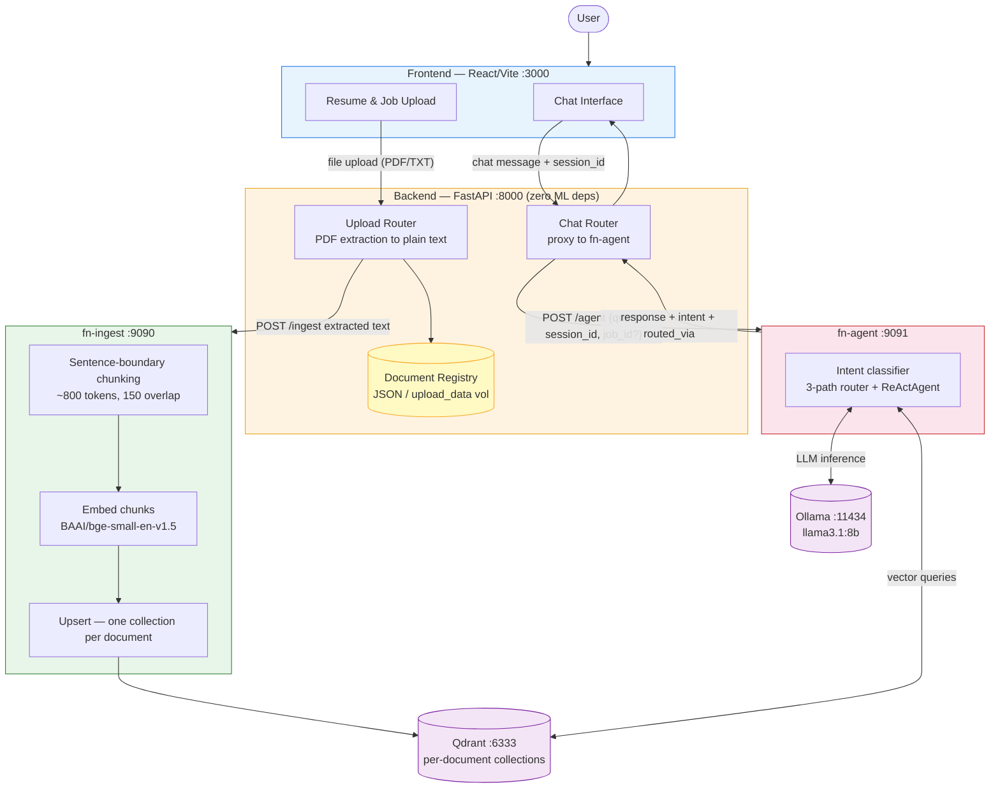
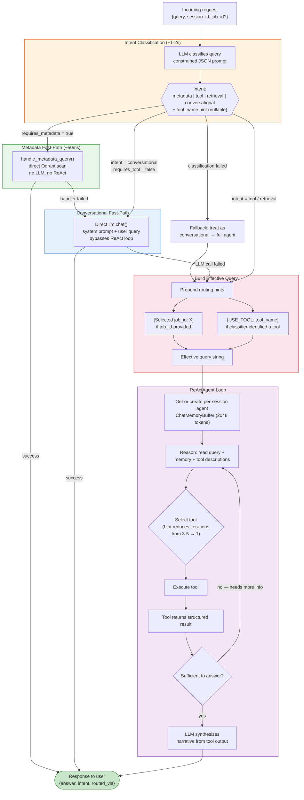
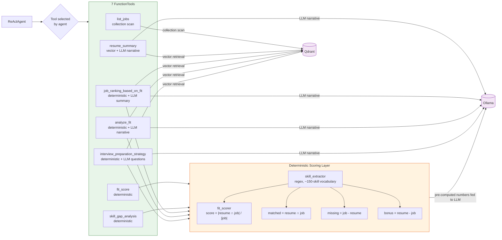

# System Flowcharts

## 1. System Architecture — Service Interaction

---

## 2. AI Core — fn-agent Internal Flow

---

## 3. ReActAgent — Tool Execution Detail

**Key:** The LLM never computes scores or skill matches. Every number flows through the deterministic layer first. The LLM receives pre-computed results and writes narrative around them.
